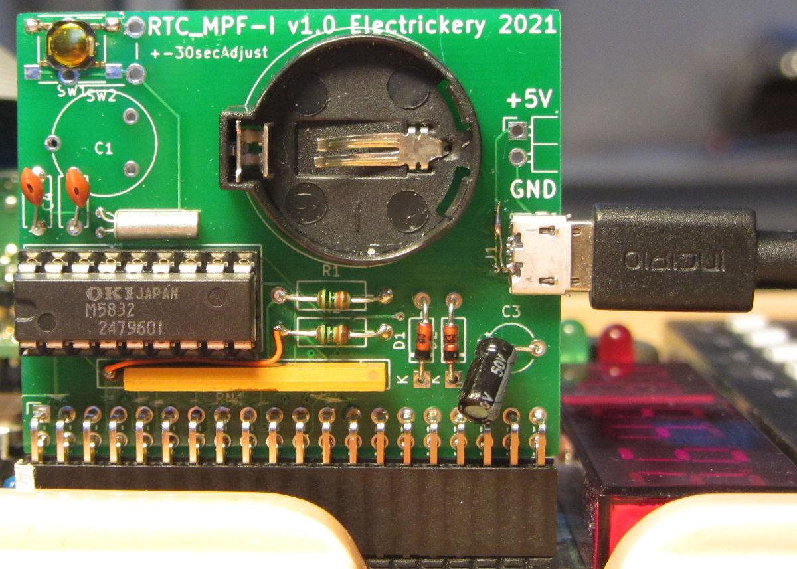

# RTC-MPF-I
A Real Time Clock for the Microprofessor based on a MSM5832

This used the Z80-PIO to interface the MSM5832. Currently only the 
rudimnts are implemented to write and read the RTC and display time
and date.

The hardware diagram:

The board: 

The source code is assembled with z80pack/z80asm from 
https://github.com/udo-munk/z80pack. Uploading to the 
MPF-memory is done with https://github.com/electrickery/ROM-emulator.

Both hardware and software is in the debugging phase.
